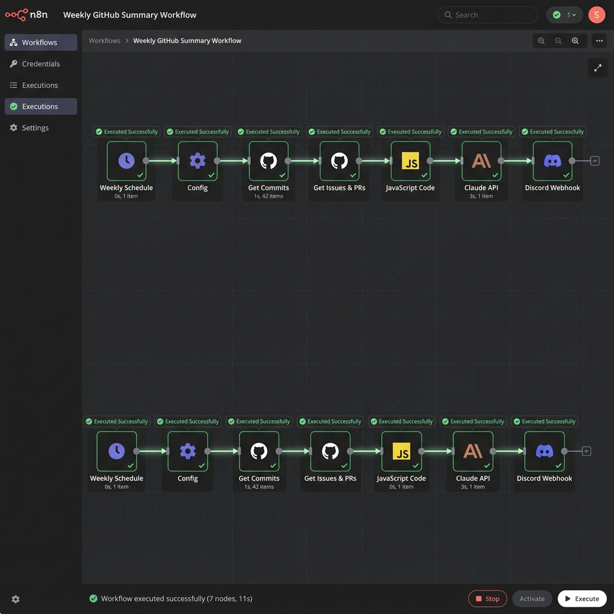

# 🚀 Automated Weekly GitHub Dev Summary (n8n + Claude Code)

An exportable, production-ready n8n workflow that automatically aggregates weekly activity (commits, closed issues, merged PRs) from any GitHub repository, calls the Claude API (`claude-sonnet-4-20250514`) to generate a narrative developer-focused summary, and delivers it to a Discord or Slack webhook.

## 📋 Features
- 🕒 **Weekly Cron Trigger**: Runs automatically every Friday at 5:00 PM.
- ⚡ **Activity Aggregation**: Fetches all commits, closed issues, and merged pull requests from the past 7 days.
- 🤖 **Claude AI Synthesis**: Uses Anthropic's state-of-the-art Claude 3.5 Sonnet to write a professional narrative release and activity summary.
- 💬 **Instant Notification**: Delivers clean, Discord-optimized Markdown summaries via webhook.

---

## 🛠️ Setup Instructions (3 Steps)

Follow these steps to deploy the workflow in under 2 minutes:

### 1. Import the Workflow
1. Open your n8n workspace.
2. Click **Workflows** > **Import from File** (or copy the contents of `github_weekly_summary.json` and paste them directly onto the canvas).

### 2. Configure Your Variables
Double-click the **Config** node and enter your credentials and settings:
- `owner`: The GitHub repository owner (e.g. `expressjs`).
- `repo`: The GitHub repository name (e.g. `express`).
- `language`: The summary output language (`EN` or `FR`).
- `discord_webhook_url`: Your Discord/Slack Channel Webhook URL.
- `github_token`: Your GitHub Personal Access Token (PAT).
- `anthropic_api_key`: Your Anthropic Claude API Key.

### 3. Save & Activate
Click **Save** in the top right corner, then toggle the workflow to **Active** to start the weekly cron schedule. Click **Execute Workflow** to test the setup immediately.

---

## 📸 Workflow Execution Proof

Here is a screenshot showing a successful test execution of the workflow in n8n:

